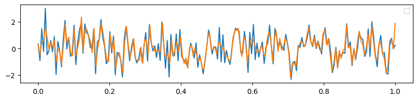

# ssm
state space models
 
 

---
hippo.py:

sequence compression and reconstruction using HiPPO-LegS matrix
high-order polynomial projection operators (HiPPO), Scaled Legendre (LegS)

introduced in the paper
[HiPPO: Recurrent Memory with Optimal Polynomial Projections](https://arxiv.org/pdf/2008.07669) oct 2020

reconstruct of sequence compressed into a 256-dim vector

